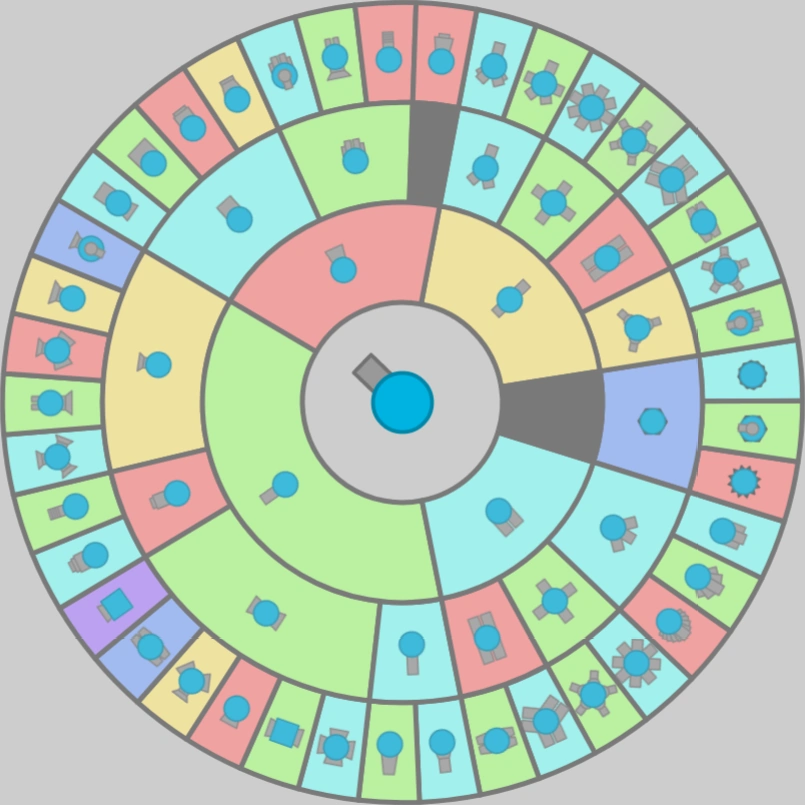
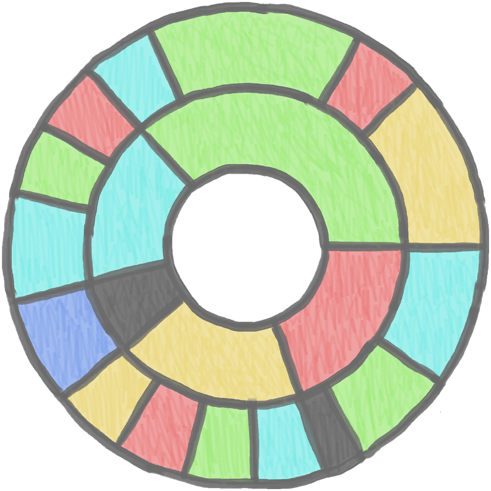
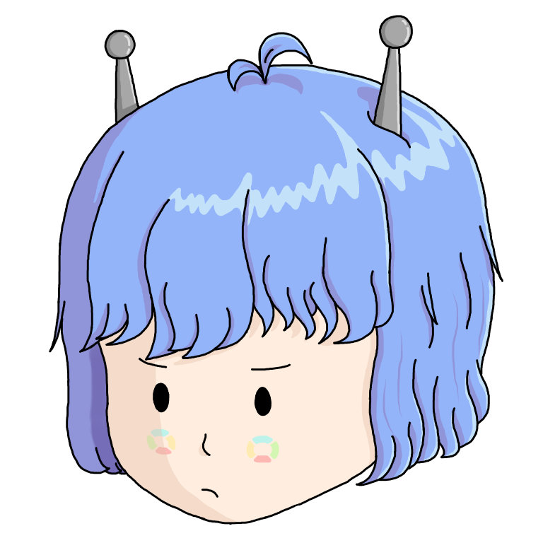

# HiZollo 的頭像
好久沒寫心得文了，剛好最近畫了一顆頭，還是把筆撿回來寫一下好了。

## 契機
最最開始的時候，HiZollo 的頭像長得跟 Diep.io 的坦克升級表超像，喔其實是一模一樣啦，因為那個就是坦克升級表的截圖。畢竟這台機器人是從 [Diep.io 繁中維基](https://diepio.fandom.com/zh/wiki/)發跡的，那時候 AC 就直接選這張了。

但自從我加入團隊沒多久後  
我就覺得直接抄別人不太好  
所以問ＡＣ要不要換個頭像  
經過一番討論之後他說可以  
所以我就開始改坦克升級表  
更改後的結果就是現在這樣  
這還有個好處是換色很方便  
所以之後的節日只要我有空  
我就會重配每個區塊的顏色  
中間再加個節日相關的東西  
就直接變成節慶特典頭像了  
到現在也換了好幾次的頭像  

這樣的結果對我來說，我其實還算滿意，畢竟頭像都是我們自己弄的，雖然還是以別人為模板啦，但至少不是直接截圖，而且用畫的品質一定比截圖還要好。

但就在 AC 最近架新網站的時候，當我看到他把 HiZollo 的 logo 大喇喇擺在首頁，我才發現原來我們的 logo 一直都這麼醜。

先不說每個色塊裡面亂塗的斜線是怎麼回事，連邊框的線都沒接好是怎樣。你如果想問我，啊這些問題你一開始不知道嗎？我當然知道啊，但我沒想過這個小畫家作品現在會直接被這樣放大檢視，原本遠遠看好好的圖（有嗎），近看直接崩壞，連我自己都沒辦法接受。

所以說，我就又跟 AC 說第二次換頭像的事情了，我問他有沒有要什麼特別的設定，他直接回我說沒差，反正不是他畫。

確實。

## 人設
其實本來 HiZollo 沒什麼人設，就只是普通的機器人而已，但某次我們加了嗆人的元素，好像是某個隱藏指令的回應吧，他就踏上嗆人的不歸路了。

反正從那時候開始，HiZollo 的人設才開始慢慢成形，就是一個看不慣所有人（和所有機器人）的厭世機器人。這也只是我的想法啦，我也沒有跟 AC 討論過人設這件事。

反正他也說隨我畫，所以我就根據厭世這個特性去畫了。喔對，還有蘿莉，不要問我為什麼。

## 長相
直接看圖的話，會發現 HiZollo 是頭髮有點亂，然後臉有點臭的小女生，我個人覺得是有符合他厭世的個性啦，不知道你各位怎麼看。

## 我不知道標題要叫什麼兩個字的詞所以就長這樣好了
> 既然 AC 都說 HiZollo 隨我畫了，我再寫一篇故事也可以吧，既然是我寫的，那應該也算是官方釋出的故事吧。

HiZollo 剛被製造出來的時候，我就看過她了，雖然那時候我還沒加入 AC 的團隊。她那時候跟其他女孩沒有什麼不同，黑髮黑眼睛，有時候會做一些白癡事情，講笑話給她聽的時候她也都笑得很開心。要不是他頭上的兩根天線太顯眼了，她其實就是普通的女孩子。AC 能把機器人做得那麼真我也是蠻佩服的。

### 我講笑話她不只聽不懂，還會亂嗆人，你要怎麼解釋？
因為那是她在 DC 上的樣子，不是她本人。她的身體裡有兩套系統，一套是跟現實生活互動的擬真系統，一套是跟 DC 互動的機器人系統。

### 為什麼不要把擬真系統套用到 DC 上？
因為那套系統對運算效能要求很高，你沒看他現在面對二十幾萬個使用者就快爆炸了，如果都用擬真系統，我真的無法想像她會發生什麼事情。

反正，就像我說的，撇開天線跟她不用吃飯的事實，她本人就是普通的女孩子。我記得之前他還問我為什麼她沒有耳朵其他人都有，我跟她說天線就夠了，她還在那邊盧說她也要有耳朵，幹，天線強多了好嗎，要不是我是人類，我也想要加裝一個欸。

### 正常的女孩子會隨便嗆人嗎？
當然不會啊，她本來才不會這樣，我在猜可能是她燙完頭髮之後就變現在這樣的。

HZ：「欸，我可以燙頭髮嗎？」  
我：「你真的很沒禮貌欸，AC 應該有教你吧。而且你怎麼知道什麼是燙頭髮？」  
HZ：「我剛剛在網路上查到的。」  
我：「……好喔，但我不會，你去問 AC。」  

她興沖沖跑進 AC 的辦公室，三分鐘後又無精打采地跑回來我這裡，嗯，果然 AC 也不會。

之後我和 AC 還特別針對這件事討論，我問他你還記不記得 HiZollo 的頭髮是跟誰訂的，跟他們再訂一頂捲髮來就好，AC 說他忘了（我：？？？），而且頭和頭髮是一體成形的，不能只換頭髮，所以要嘛不換，要嘛整顆頭換掉。但整顆頭換掉就很麻煩，整個線路全部都要重組。

我們也不想直接把她帶出去燙頭髮，誰知道別人看到他頭上兩根天線會有什麼想法。所以最終討論的結果就是我們幫她燙，這應該是我們做過最白癡的決定了，兩個沒燙過頭髮的人在幫一個想燙頭髮的人燙頭髮。

後續我不想講了，現在她頭髮這麼亂就是因為那時候我們亂搞她。

前一陣子我們幫她染完頭髮她其實也不太開心，說什麼看起來不好看，她自己根本也不知道什麼才叫做好看吧。

## 後記
不小心寫太長了，所以後記就短一點好了。
